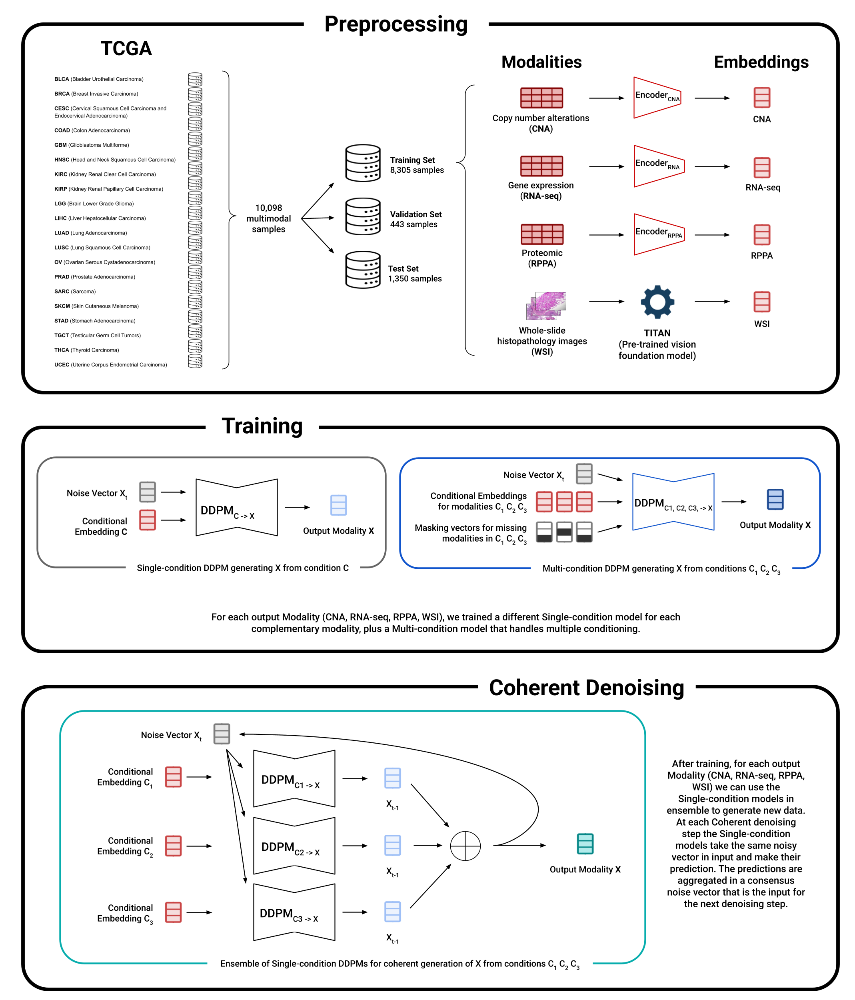

# Coherent Cross-modal Generation of Synthetic Biomedical Data to Advance Multimodal Precision Medicine

Repository for the paper [**"Coherent Cross-modal Generation of Synthetic Biomedical Data to Advance Multimodal Precision Medicine"**, by Raffaele Marchesi, Nicolò Lazzaro, Walter Endrizzi, Gianluca Leonardi, Matteo Pozzi, Flavio Ragni, Stefano Bovo, Monica Moroni, Venet Osmani, Giuseppe Jurman.](https://www.biorxiv.org/content/early/2025/08/27/2025.08.22.671728)

If you use this repository, please cite:
```plaintext
@article{marchesi2025coherent,
  title={Coherent Cross-modal Generation of Synthetic Biomedical Data to Advance Multimodal Precision Medicine},
  author={Marchesi, Raffaele and Lazzaro, Nicolo and Endrizzi, Walter and Leonardi, Gianluca and Pozzi, Matteo and Ragni, Flavio and Bovo, Stefano and Moroni, Monica and Osmani, Venet and Jurman, Giuseppe},
  journal={bioRxiv},
  pages={2025--08},
  year={2025},
  publisher={Cold Spring Harbor Laboratory}
}
```

## Abstract

Integration of multimodal, multi-omics data is critical for advancing precision medicine, yet its application is frequently limited by incomplete datasets where one or more modalities are missing. To address this challenge, we developed a generative framework capable of synthesizing any missing modality from an arbitrary subset of available modalities. We introduce Coherent Denoising, a novel ensemble-based generative diffusion method that aggregates predictions from multiple specialized, single-condition models and enforces consensus during the sampling process. We compare this approach against a multi-condition, generative model that uses a flexible masking strategy to handle arbitrary subsets of inputs. The results show that our architectures successfully generate high-fidelity data that preserve the complex biological signals required for downstream tasks. We demonstrate that the generated synthetic data can be used to maintain the performance of predictive models on incomplete patient profiles and can leverage counterfactual analysis to guide the prioritization of diagnostic tests. We validated the framework's efficacy on a large-scale multimodal, multi-omics cohort from The Cancer Genome Atlas (TCGA) of over 10,000 samples spanning across 20 tumor types, using data modalities such as copy-number alterations (CNA), transcriptomics (RNA-Seq), proteomics (RPPA), and histopathology (WSI). This work establishes a robust and flexible generative framework to address sparsity in multimodal datasets, providing a key step toward improving precision oncology.


## Project Pipeline

 


## Repository Structure

The repository is organized into the main analysis codebase and the data preprocessing pipeline.

* `code/`: Contains the core logic for model training, downstream analysis, and visualization.
    * `autoencoders/`: Scripts for training and using the modality-specific autoencoders to create the harmonized latent space.
    * `downstream/`: Contains all scripts and notebooks to reproduce the downstream analyses and figures presented in the paper (e.g., reconstruction fidelity, performance rescue, counterfactual inference).
    * `lib/`: A library of shared modules, including dataset handlers, diffusion model definitions, and training/sampling loops.
    * `main_train.py` & `main_test.py`: Main entry points for training the generative models and running evaluations.
    * `ZZZ_*.ipynb`: Exploratory notebooks for visualizing results and intermediate analyses.
* `preprocessing_TCGA/`: A sequential, numbered pipeline of scripts to download and process the raw TCGA data into the format required for the analysis.


## Data Availability

The raw TCGA data used in this study was sourced from the Open Access tier of The Cancer Genome Atlas (TCGA) and is publicly available for download from the [GDC Data Portal](https://portal.gdc.cancer.gov/) and the [UCSC Xena Hub](https://xenabrowser.net/). The `preprocessing_TCGA/` pipeline in this repository can be used to regenerate the intermediate files from this raw data.

To ensure full reproducibility of all downstream analyses, all processed data files (training, validation, test sets) and all generated synthetic data (embeddings from both Coherent Denoising and Multi-Condition models) are available for download at this [link](https://drive.google.com/drive/folders/1npiT7jfAFarHcLNwXkefbRBGjyWXvnCD?usp=sharing).


## Requirements

Enviroment requirements for this project can be found in `requirements.txt`

## Contact

For any questions, please contact Raffaele Marchesi at rmarchesi@fbk.eu.
